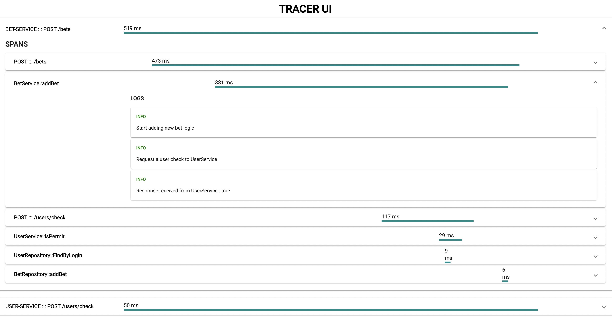

# <strong style="color:#1f6363">gRPC </strong>-TRACER

## 
Le projet : 

Ce projet est un POC d'utilisation de la technologie <strong style="color: #1f6363"> gRPC </strong> aussi bien coté server que coté client.

Il implémente une infrastructure de tracing de log distribué.

Cette infrastructure de tracing est constituée de 3 composants :

- <strong style="color: chocolate" xmlns="http://www.w3.org/1999/html" xmlns="http://www.w3.org/1999/html"> Le tracing-server </strong>
    
    Il est chargé de créer et d'enregistrer les différentes traces et logs provenant de différents micro-services.
    
    Il expose aussi les informations relatives aux traces.

- <strong style="color: chocolate"> Le tracing-client </strong>

    Il sert d'intermédiaire entre les micro-services et le **Tracing-server**.
    
    C'est lui qui envoie les différentes requêtes d'enregistrement de traces ou de logs vers le **Tracing-server**.

- <strong style="color: chocolate"> Le tracing-ui </strong>
    
    C'est l'interface utilisateur permettant de visualiser les traces des différents micro-services.

 

 
    La communication entre ces différents composants se fait via le protocole <strong style="color: #1f6363"> gRPC </strong> 

## 
Comment le tester ? 

    git clone https://github.com/henriSedjame/grpc-tracer.git
    
    cd grpc-tracer

Sur un terminal #1
    
    make start-tracer

Sur un terminal #2

    make start-user-service

Sur un terminal #3

    make start-bet-service

La première commande lance le <strong style="color: chocolate">Tracing-server</strong>, le <strong style="color: chocolate">Tracing-UI</strong> et un  proxy Envoy . Le proxy permet la communication gRPC entre le server et le web.

Les deux dernières commandes lancent deux micro-services: User-Service et Bet-Service.

Sur un navigateur allez sur l'url <a> http://localhost:4200</a>

 

Effectuez ensuite les appels http suivants : 

    POST http://localhost:9002/bets
    Content-Type: application/json
    Authorization: joe:joe1234
    
    {
      "name": "joe",
      "amount": 10
    }

&&

    POST http://localhost:9001/users/check
    Content-Type: application/json

    {
      "login" : "joe",
      "password": "joe1234"
    }

 

Vous devriez obtenir le résultat suivant : 👇

</img>

